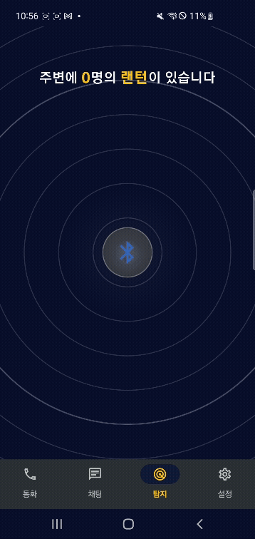

# SSAFY 12기 E204 Lantern - 랜턴


### 📡 통신이 끊겨도 걱정 마세요! 
### 🚶‍♀️ BLE Mesh로 사용자와 즉시 연결! 
### 🆘 재난 속 구조 요청부터 오프라인 소셜까지, 당신 곁엔 언제나 랜턴!

<br>

## 목차

> - [👋 프로젝트 소개](#프로젝트-소개)
> - [📖 랜턴 컨셉](#쏙쏙-컨셉)
> - [✏️ 주요 기능](#주요-기능-및-기술-활용)
> - [👩‍👩‍👧‍👧 팀원 소개](#팀원-소개)
> - [🖲️ ERD](#ERD)
> - [📌 API 명세서](#API-명세서)
> - [🚨 기능명세서](#기능명세서)
> - [📋 배포 링크](#배포-링크)
> - [💻 아키텍쳐 구조도](#아키텍쳐-구조도)
> - [🖥️ 기술 스택](#기술-스택)


<br>

## 프로젝트 소개
 - 서비스 명: <b>랜턴 (Lantern) 
 - ✅ BLE Mesh 기반으로 인터넷 없이도 사용자 간 텍스트 및 음성 메시지를 주고받을 수 있는 오프라인 통신 애플리케이션
 - ✅ 재난, 통신 음영 지역, 대규모 행사 현장 등에서 Mesh 네트워크를 자율 구성하여 안정적인 긴급 구조 및 소셜 커뮤니케이션 제공상호작용에 직접 반영
 - ✅ 로컬 DB 기반 메시지 저장, TTL 설정 및 중복 전송 방지 기능을 포함하며, 온디바이스 AI를 활용한 음성 구조 요청 기능까지 지원

<br>

## 랜턴 컨셉
### 🕯️ 오프라인에서도 이어지는 연결
- BLE Mesh 기술을 활용하여 인터넷 없이도 주변 사용자와 실시간 소통 가능
### 🚨 위급 상황을 위한 즉각 대응
- 통신망이 끊긴 재난 현장에서도 구조 요청 및 음성 메시지를 릴레이 전달
### 📱 참여자 중심의 자율 네트워크
- 스마트폰들이 자동으로 중계 노드가 되어, 네트워크를 구성하고 유지
### 🗣️ 말로 전하는 구조 요청
- 온디바이스 AI 음성인식 기반으로, 손이 불편한 상황에서도 음성만으로 주변에 도움 요청

<br>

## 주요 기능 및 기술 활용
### 시연 영상(YouTube)
<!-- [](https://youtu.be/3BXyRPZQ93U) -->
### 

### 📡 BLE Mesh 기반 통신
 - 스마트폰 간 Bluetooth Low Energy 통신을 활용하여 자율적으로 Mesh 네트워크 구성
 - 인터넷이나 Wi-Fi 없이도 통신 가능
 - 중간 노드를 통한 다중 홉(hop) 메시지 및 음성 데이터 릴레이




### 💬 텍스트 메세지 송수신
- 메세지 TTL을 설정하여 전송 거리 및 횟수 제한
- UUID 및 해시 기반 중복 메시지 필터링을 통한 불필요한 재전송 방지
- 패킷 유실 최소화를 위한 큐 기반의 순차 처리 및 재전송 전략
- 수신 즉시 메시지를 브로드캐스트하여 실시간 네트워크 전파


### 🎮 게임 요소 진행 
- webRTC와 socket을 사용하여 실시간으로 친구와 상호작용
- 동화 진행 중 미션 수행 (ex 마녀와 가위바위보)

 
### 📷 나만의 앨범 생성
- 동화 진행 중 엄지 척 모션을 통한 화면 캡처로 사용자가 기억하고 싶은 순간을 저장


<br>

## 팀원 소개
| 이름 | 역할 |
|:--:|:--:|
| 👑 **[이동규 (팀장)](https://github.com/Iwannabegosu)**| BE & INFRA|
| 🌟 **[김한민](https://github.com/skdud5126)** | FE |
| ✏️ **[천세윤](https://github.com/jhnam0324)** | BE |
| 🐶 **[도경원](https://github.com/xongeeuse)** | FE |
| 🚀 **[박수민](https://github.com/garam0107)** | BE |

<br>

## ERD


<br>

## API 명세서
### - 동화 관련 API

### - 유저 관련 API

### - 친구 관련 API


<br>

## 기능명세서


<br>

## 배포 링크

https://j12e201.p.ssafy.io/

<br>


## 기술스택

```
Front-End
- React, TailwindCSS, Zustand, node.js, JavaScript

Back-end 
- Java
- Spring Boot
- Spring Web
- Spring Security
- Spring cloud gateway
- Spring cloud netflix eureka
- redis
- mysql

Infra
- Ubuntu
- Docker
- Jenkins

```


<br>


## 아키텍쳐 구조도


---

