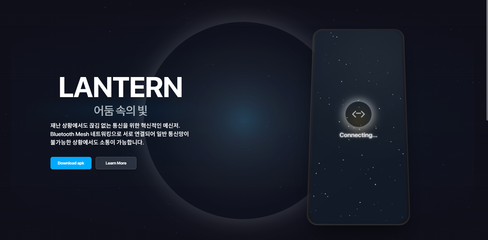

\# 랜턴 (Lantern) 🏮  
\#\#\# BLE Mesh 기반 오프라인 재난 및 일상 통신 앱

\> \#\# 🔖 목차  
\>  
\> 1\.  \[✨ 프로젝트 소개\](\#-프로젝트-소개)  
\> 2\.  \[💡 기획 배경\](\#-기획-배경)  
\> 3\.  \[👫 대상\](\#-대상)  
\> 4\.  \[🎉 기대 효과\](\#-기대-효과)  
\> 5\.  \[🔉 주요 기능\](\#-주요-기능)  
\> 6\.  \[🔧 기술 스택\](\#-기술-스택)  
\> 7\.  \[⚙️ 아키텍처\](\#️-아키텍처)  
\> 8\.  \[🛠️ 설치 및 실행\](\#️-설치-및-실행)  
\> 9\.  \[📖 사용 방법\](\#-사용-방법)  
\> 10\. \[🔬 핵심 기능 상세\](\#-핵심-기능-상세)  
\> 11\. \[📂 프로젝트 구조\](\#-프로젝트-구조)  
\> 12\. \[👥 팀원 소개\](\#-팀원-소개)  
\> 13\. \[📄 프로젝트 산출물\](\#-프로젝트-산출물)  
\> 14\. \[📜 라이선스\](\#-라이선스)

\---

\#\# ✨ 프로젝트 소개  
\*\*랜턴(Lantern)\*\*은 인터넷 연결이 불안정하거나 불가능한 환경(예: 재난 상황, 외딴 지역)에서도 사용자들이 서로 통신할 수 있도록 지원하는 안드로이드 애플리케이션입니다. Bluetooth Low Energy (BLE) Mesh 네트워크를 기반으로 하며, 데이터 네트워크나 Wi-Fi 없이 사용자 간 메시지 교환 및 음성 통화, 그리고 On-Device AI를 활용한 긴급 구조 요청 기능을 제공하여 사용자의 안전과 연결을 최우선으로 합니다.

\---

\#\# 💡 기획 배경  
현대 사회는 통신 기술에 크게 의존하고 있지만, 자연재해나 특정 환경(산악, 해상, 지하 등)에서는 기존 통신 인프라가 쉽게 마비되거나 접근 불가능한 경우가 많습니다. 이러한 상황에서 신속한 정보 공유와 구조 요청의 어려움은 인명 피해로 이어질 수 있습니다.  
\*\*랜턴\*\*은 이러한 통신 공백을 메우기 위해 기획되었습니다. 중앙 서버 없이 기기 간 직접 통신(Device-to-Device)이 가능한 BLE Mesh 기술을 활용하여, 사용자들이 자체적으로 안정적인 비상 통신망을 구축하고, 특히 On-Device AI를 통해 오프라인 환경에서도 지능적인 긴급 구조 요청이 가능하도록 하는 것을 목표로 합니다.

\---

\#\# 👫 대상  
\* \*\*등산객, 캠핑족, 탐험가:\*\* 통신 음영 지역에서의 안전 확보 및 동료와의 소통 수단이 필요한 야외 활동 애호가.  
\* \*\*재난 대비 개인 및 지역 사회:\*\* 지진, 태풍, 홍수 등 자연재해 발생 시 기존 통신망 두절에 대비한 비상 연락망 구축을 원하는 사용자.  
\* \*\*오프라인 이벤트 및 활동 그룹:\*\* 특정 지역 내에서 일시적으로 데이터 사용 없이 소통 네트워크가 필요한 행사 운영자 및 참가자.  
\* \*\*데이터 사용에 민감한 사용자:\*\* 데이터 요금 부담 없이 근거리에서 메시징 및 음성 통화를 원하는 사용자.

\---

\#\# 🎉 기대 효과  
\* \*\*생존성 및 안전성 향상:\*\* 재난 및 긴급 상황 발생 시 신속한 구조 요청과 상황 공유를 통해 인명 구조 및 피해 최소화에 기여합니다.  
\* \*\*통신 자립성 증대:\*\* 외부 통신 인프라에 대한 의존도를 낮추고, 사용자가 주체가 되어 통신 네트워크를 형성 및 유지할 수 있습니다.  
\* \*\*정보 접근성 개선:\*\* 통신 두절 상황에서도 주변 사람들과 필요한 정보를 교환하여 고립을 방지하고 공동체적 대응 능력을 강화합니다.  
\* \*\*사회적 연결 유지:\*\* 어려운 환경 속에서도 소통을 지속함으로써 심리적 안정감을 제공하고 사회적 유대감을 유지하는 데 도움을 줍니다.

\---

\#\# 🔉 주요 기능

\#\#\# 💬 메시 네트워크 채팅  
\-   인터넷 없이 주변 사용자와 1:1 및 그룹(공개) 채팅이 가능합니다.  
\-   텍스트 메시지, (구현 시) 간단한 이모티콘 전송을 지원합니다.

\#\#\# 🗺️ 주변 사용자 탐색  
\-   BLE 신호를 이용하여 근처의 다른 랜턴 사용자를 실시간으로 탐색합니다.  
\-   탐색된 사용자 목록 및 (구현 시) 상대적 거리/방향 정보를 제공하여 연결을 용이하게 합니다.

\#\#\# 🆘 On-Device AI 기반 구조 요청  
\-   네트워크 연결 없이, 기기 내 AI가 특정 음성 명령(예: "살려주세요")을 인식하여 자동으로 긴급 구조 신호를 주변에 발신합니다. (\`WakeWordService.kt\` 활용)  
\-   구조 요청 시 (설정된 경우) GPS 기반 위치 정보, 사용자 상태 등의 정보를 포함하여 전송합니다.  
\-   주변 사용자에게 즉각적인 시청각 알림을 제공하여 신속한 구조 활동을 유도합니다.

\#\#\# 📞 음성 통화  
\-   BLE Mesh 네트워크를 통해 주변 사용자와 데이터 요금 없이 실시간 음성 통화를 지원합니다.  
\-   GATT 프로토콜을 통해 음성 데이터를 패킷화하여 전송합니다.

\---

\#\# 🔧 기술 스택  
\* \*\*Platform:\*\* Android  
\* \*\*Language:\*\* Kotlin  
\* \*\*UI:\*\* Jetpack Compose  
\* \*\*Architecture:\*\* MVVM (Model-View-ViewModel)  
\* \*\*Asynchronous Programming:\*\* Kotlin Coroutines & Flow  
\* \*\*Dependency Injection:\*\* Hilt  
\* \*\*Networking (BLE):\*\*  
    \* Android Bluetooth Low Energy (BLE) API  
    \* GATT (Generic Attribute Profile) 프로토콜  
\* \*\*Networking (Server \- 인증 등):\*\*  
    \* Retrofit2 & OkHttp3 (\`AuthService.kt\`)  
\* \*\*On-Device AI:\*\*  
    \* Android \`SpeechRecognizer\` API (음성 명령 인식)  
    \* (\*\*\[만약 TFLite 등 별도 모델 사용 시 모델명/라이브러리 명시\]\*\*)  
\* \*\*Database:\*\* Room Persistence Library (\`AppDatabase.kt\`)  
\* \*\*Image Handling:\*\* Coil (또는 사용된 라이브러리)  
\* \*\*Build Tool:\*\* Gradle  
\* \*\*Key Permissions:\*\* \`BLUETOOTH\_SCAN\`, \`BLUETOOTH\_ADVERTISE\`, \`BLUETOOTH\_CONNECT\`, \`ACCESS\_FINE\_LOCATION\`, \`RECORD\_AUDIO\`, \`POST\_NOTIFICATIONS\`, \`FOREGROUND\_SERVICE\`, \`READ\_PHONE\_STATE\` (통화 상태 감지 등)

\---

\#\# ⚙️ 아키텍처  
랜턴 앱은 \*\*MVVM (Model-View-ViewModel)\*\* 아키텍처 패턴을 채택하여 UI 로직과 비즈니스 로직을 분리하고, 테스트 용이성과 유지보수성을 높였습니다.

\* \*\*UI Layer (View):\*\* Jetpack Compose를 사용하여 선언적으로 화면을 구성합니다. 사용자 인터랙션은 ViewModel로 전달되며, ViewModel에서 관리하는 UI 상태(StateFlow, SharedFlow 등)를 구독하여 화면을 업데이트합니다. (\`MainActivity.kt\`, \`ui/screens/\` 하위 컴포저블)  
\* \*\*ViewModel Layer:\*\* 각 화면에 필요한 데이터와 UI 상태를 관리하고, 비즈니스 로직을 수행합니다. Repository를 통해 데이터 계층과 통신하며, Hilt를 통해 의존성을 주입받습니다. (\`ui/screens/\*\*/ViewModel.kt\` 파일들)  
\* \*\*Data Layer (Model):\*\*  
    \* \*\*Repository:\*\* 데이터 접근을 추상화하는 인터페이스와 그 구현체로 구성됩니다. 데이터 소스(로컬 DB, BLE, 원격 서버)로부터 데이터를 가져오거나 저장하는 역할을 담당합니다. (\`data/repository/\`)  
    \* \*\*Data Sources:\*\*  
        \* \*\*Local:\*\* Room DB를 사용하여 사용자 정보, 채팅 내역, 통화 기록 등을 영구적으로 저장합니다. (\`data/database/\`, \`UserDao.kt\`, \`MessagesDao.kt\` 등)  
        \* \*\*BLE:\*\* \`BleManager.kt\`와 \`BleService.kt\`를 중심으로 BLE 스캔, 광고, GATT 연결 관리, 데이터 송수신 등 저수준 BLE 통신 로직을 수행합니다. (\`data/source/ble/\`)  
        \* \*\*Remote:\*\* Retrofit 라이브러리를 사용하여 Google 로그인 인증 등 외부 서버와의 API 통신을 처리합니다. (\`data/source/remote/AuthService.kt\`)  
    \* \*\*Entities/Data Models:\*\* 앱 전반에서 사용되는 데이터 객체를 정의합니다. (\`data/model/\`, \`ChatMessage.kt\`)  
\* \*\*Services:\*\* \`BleService\` (백그라운드 BLE 통신 및 네트워크 관리), \`WakeWordService\` (백그라운드 음성 명령 감지) 등 지속적인 작업이 필요한 기능을 백그라운드 서비스로 구현합니다.  
\* \*\*Dependency Injection:\*\* Hilt를 사용하여 클래스 간의 의존성을 관리하고, 코드의 결합도를 낮춥니다. (\`di/\` 모듈)

\*\*(PPT에 아키텍처 다이어그램이 있다면 해당 내용을 기반으로 간단한 텍스트 설명이나 ASCII 아트로 표현 가능)\*\*

\---

\#\# 🛠️ 설치 및 실행

\#\#\# 필수 조건 (Prerequisites)  
\* Android Studio \[Hedgehog | 2023.1.1 Patch 2\] 또는 그 이상  
\* Android SDK:  
    \* \`minSdk \= 26\` (Android 8.0 Oreo)  
    \* \`compileSdk \= 34\` (Android 14\)  
    \* \`targetSdk \= 34\`  
\* JDK 17  
\* 실제 Android 기기 2대 이상 (BLE 기능 및 Mesh 네트워크 테스트를 위해 강력히 권장)

\#\#\# 설치 및 실행 (Installation & Running)  
1\.  \*\*저장소 복제:\*\*  
    \`\`\`bash  
    git clone \[여기에 프로젝트 GitHub 저장소 URL을 입력하세요\]  
    cd Lantern  
    \`\`\`  
2\.  \*\*(필요시) API 키 설정:\*\*  
    \* Google 로그인 등 외부 서비스 연동을 위해 \`local.properties\` 파일에 필요한 API 키를 설정합니다. (프로젝트에 해당 사항이 없다면 이 단계는 생략합니다.)  
    \`\`\`properties  
    \# local.properties (예시)  
    \# GOOGLE\_OAUTH\_CLIENT\_ID="YOUR\_GOOGLE\_OAUTH\_CLIENT\_ID"  
    \`\`\`  
3\.  \*\*Android Studio에서 프로젝트 열기:\*\*  
    \* Android Studio를 실행하고 'Open'을 선택하여 로컬에 복제된 \`Lantern\` 프로젝트 디렉토리를 엽니다.  
4\.  \*\*프로젝트 빌드:\*\*  
    \* Gradle 동기화가 자동으로 시작되며, 완료 후 메뉴에서 \`Build \> Make Project\`를 선택하거나 Gradle 패널에서 \`build\` 태스크를 실행합니다.  
5\.  \*\*앱 실행:\*\*  
    \* 실행 구성을 선택하고, 연결된 실제 Android 기기 또는 에뮬레이터에서 \`Run 'app'\`을 클릭합니다.  
    \* \*\*참고:\*\* BLE 관련 기능은 에뮬레이터에서 완벽하게 동작하지 않을 수 있으므로, 실제 기기에서의 테스트가 필수적입니다. 특히 Mesh 네트워크 동작을 확인하려면 여러 대의 기기가 필요합니다.

\---

\#\# 📖 사용 방법

1\.  \*\*앱 최초 실행 및 권한 동의:\*\*  
    \* 앱을 처음 실행하면 위치, 블루투스, 마이크, 알림 등 서비스 제공에 필요한 권한을 요청합니다. 모든 권한에 동의해야 정상적인 기능 사용이 가능합니다.  
    \* Google 계정을 통해 간편하게 로그인하고(\`LoginScreen.kt\`), 앱에서 사용할 프로필(닉네임, 프로필 사진 등)을 설정합니다.  
2\.  \*\*주변 탐색 및 연결 (\`MainScreen.kt\`):\*\*  
    \* 메인 화면에서는 BLE를 통해 주변의 다른 랜턴 사용자를 탐색하고, 지도 또는 리스트 형태로 표시합니다.  
    \* 탐색된 사용자를 탭하여 상세 프로필을 확인하거나, 채팅 또는 음성 통화를 시작할 수 있습니다.  
3\.  \*\*채팅 기능 (\`ChatListScreen.kt\`, \`PublicChatScreen.kt\`, \`DirectChatScreen.kt\`):\*\*  
    \* 하단 네비게이션 바의 '채팅' 탭에서 현재 참여 중인 채팅방 목록을 확인합니다.  
    \* '공개 채팅'에 참여하여 범위 내 모든 사용자와 대화하거나, 특정 사용자와 '1:1 채팅'을 시작하여 비공개 대화를 나눌 수 있습니다.  
4\.  \*\*음성 통화 기능 (\`CallHistoryScreen.kt\`, \`OngoingCallScreen.kt\`):\*\*  
    \* 사용자 프로필 또는 채팅 화면에서 통화 아이콘을 눌러 음성 통화를 발신합니다.  
    \* 다른 사용자로부터 전화가 걸려오면 수신 화면이 나타나며, 통화를 수락하거나 거절할 수 있습니다.  
    \* 통화 기록은 '통화' 탭에서 확인할 수 있습니다.  
5\.  \*\*On-Device AI 구조 요청:\*\*  
    \* \*\*활성화:\*\* (예시) 앱 설정 메뉴에서 '긴급 구조 요청 음성 인식 기능'을 활성화합니다.  
    \* \*\*사용:\*\* 위급 상황 발생 시, 미리 지정된 음성 명령 (예: "살려주세요", "도와줘 랜턴\!")을 명확하게 외칩니다. 또는 화면의 SOS 버튼을 길게 누릅니다.  
    \* \*\*전파:\*\* 구조 요청이 성공적으로 인식되면, 주변 랜턴 사용자들에게 긴급 알림이 즉시 전송되며, (설정에 따라) 사용자의 현재 위치 정보가 공유됩니다.

\---

\#\# 🔬 핵심 기능 상세

\#\#\# BLE Mesh 네트워크  
랜턴은 표준 BLE 프로토콜을 기반으로 자체적인 메시(Mesh-like) 네트워크를 구성하여 오프라인 통신을 구현합니다.

\* \*\*장치 발견 및 연결 관리:\*\*  
    \* \`BleService\`는 백그라운드에서 BLE 광고(Advertising)와 스캔(Scanning)을 지속적으로 수행하여 주변 랜턴 장치를 식별합니다. 이때, \`BleConstants.SERVICE\_UUID\`와 같은 고유 식별자를 사용하여 랜턴 앱 사용자 간의 연결을 보장합니다.  
    \* 발견된 장치와는 GATT(Generic Attribute Profile) 연결을 수립하고, 필요한 서비스와 Characteristic을 탐색하여 양방향 데이터 통신 채널을 설정합니다.  
\* \*\*데이터 패킷 구조 및 전송:\*\*  
    \* PPT 자료에 따르면, 메시지 전송 시 다음과 같은 사용자 정의 패킷 구조를 활용합니다:  
        \`\[Preamble (1B) | Access Address (2B) | Header (3B) | Payload (UUID, 닉네임, 메시지, 일반/긴급 플래그 \- 가변 길이, 최대 27B 가정) | CRC (4B)\]\`  
        (실제 구현은 \`ChatMessage.kt\`, \`BleManager.kt\`의 데이터 직렬화/역직렬화 로직에서 확인 필요)  
    \* 페이로드에는 발신자 식별 정보, 메시지 내용, 메시지 유형(일반/긴급) 등이 포함되어 효율적인 정보 교환을 지원합니다.  
    \* 음성 통화 시, 오디오 데이터는 PCM 형식으로 샘플링된 후, BLE의 MTU(Maximum Transmission Unit) 크기(\`BleConstants.MTU\_SIZE\` 기본 20바이트, 협상 후 최대 512바이트 가능)에 맞춰 분할되어 전송됩니다. 수신 측에서는 이를 재조립하여 음성을 재생합니다. (\`AudioGattServerManager.kt\`, \`AudioGattClientManager.kt\`, \`audio/AudioManager.kt\` 관련 로직)  
\* \*\*메시지 릴레이 (Message Relay):\*\*  
    \* PPT 자료에서 "메세지 릴레이" 기능이 언급되었습니다. 이는 직접 통신 범위 밖에 있는 사용자에게도 메시지를 전달하기 위해, 중간에 위치한 노드가 메시지를 수신하여 다른 인접 노드에게 재전송(Flooding 또는 선택적 라우팅)하는 방식입니다.  
    \* (구체적인 릴레이 알고리즘 및 구현 깊이에 대한 설명 추가 필요 \- 예: TTL(Time-To-Live) 기반 제어, 중복 메시지 필터링 등)

\#\#\# On-Device AI 구조 요청  
인터넷 연결 없이 기기 자체의 AI 기능을 활용하여 사용자의 음성 명령을 통해 긴급 상황을 신속하게 전파합니다.

\* \*\*Wake Word (호출 명령어) 감지:\*\*  
    \* \`WakeWordService.kt\`는 안드로이드의 \`SpeechRecognizer\` API를 사용하여 백그라운드에서 특정 "Wake Word" (예: "살려주세요", "도와줘 랜턴")를 지속적으로 감지합니다.  
    \* \`WakeWordUtils.kt\`에서 음성 인식 시작, 중지 및 결과 처리와 관련된 로직을 담당할 수 있습니다.  
    \* (\*\*\[만약 외부 라이브러리나 자체 .tflite 모델을 사용했다면, 해당 기술 명시 및 모델 정보 간략히 소개\]\*\*)  
\* \*\*긴급 신호 생성 및 전파:\*\*  
    \* Wake Word가 성공적으로 감지되면, \`OnDeviceAIViewModel\` (또는 관련 로직 처리 클래스)은 현재 GPS 위치 정보, 사용자 ID, 타임스탬프 등을 포함하는 긴급 구조 메시지를 생성합니다.  
    \* 이 긴급 메시지는 BLE Mesh 네트워크를 통해 "긴급" 상태 플래그와 함께 주변의 모든 랜턴 사용자에게 즉시 브로드캐스트/멀티캐스트 됩니다. (\`MainViewModel\`의 \`emergencyEventFlow\` 또는 유사한 이벤트 스트림을 통해 UI 및 서비스에 전파)  
\* \*\*수신자 알림 및 대응 지원:\*\*  
    \* 긴급 메시지를 수신한 다른 랜턴 사용자들은 \`RescueAlertNotification.kt\` 등을 통해 즉각적인 시청각 알림(진동, 소리, 화면 알림)을 받게 됩니다.  
    \* 알림에는 발신자의 정보와 (가능하다면) 지도 상의 위치가 표시되어, 주변 사용자들이 신속하게 상황을 인지하고 구조 활동에 참여하거나 관련 기관에 신고하는 등의 대응을 할 수 있도록 지원합니다.

\---

\#\# 📂 프로젝트 구조  
주요 디렉토리 및 파일 구성은 다음과 같습니다:

Lantern/  
├── app/  
│ ├── src/  
│ │ ├── main/  
│ │ │ ├── java/com/ssafy/lanterns/ \# 프로젝트 소스 코드 루트  
│ │ │ │ ├── MyApp.kt \# Application 클래스 (Hilt 초기화 등 전역 설정)  
│ │ │ │ ├── config/ \# 상수 및 설정 값 정의 (BleConstants.kt, NeighborDiscoveryConstants.kt)  
│ │ │ │ ├── data/ \# 데이터 관리 계층  
│ │ │ │ │ ├── database/ \# Room DB 관련 (AppDatabase.kt, Dao 인터페이스, Converters.kt)  
│ │ │ │ │ ├── model/ \# 데이터 클래스 (User.kt, Messages.kt, ChatRoom.kt 등)  
│ │ │ │ │ ├── repository/ \# Repository 인터페이스 및 구현체 (UserRepository.kt, BleRepository.kt 등)  
│ │ │ │ │ └── source/ \# 실제 데이터 소스 (ble/, remote/, token/)  
│ │ │ │ ├── di/ \# Hilt 의존성 주입 모듈 (DataModule.kt, NetworkModule.kt, EventModule.kt)  
│ │ │ │ ├── service/ \# 백그라운드 서비스 (BleService.kt, WakeWordService.kt)  
│ │ │ │ │ └── ble/ \# BLE 서비스 관련 하위 패키지 (advertiser/, scanner/, gatt/)  
│ │ │ │ ├── ui/ \# UI 계층 (Jetpack Compose Screens, ViewModels, Navigation)  
│ │ │ │ │ ├── common/ \# 공통 UI 컴포넌트 (MainScaffold.kt)  
│ │ │ │ │ ├── components/ \# 재사용 가능한 UI 요소 (ChatMessageBubble.kt, NearbyUsersModal.kt)  
│ │ │ │ │ ├── navigation/ \# 화면 이동 관련 (AppNavigation.kt, AppDestinations.kt, BottomNavigationBar.kt)  
│ │ │ │ │ ├── screens/ \# 각 기능별 화면 구현 (call/, chat/, login/, main/, mypage/, ondevice/, splash/)  
│ │ │ │ │ ├── theme/ \# 앱 테마 및 스타일 (Color.kt, Theme.kt, Typography.kt)  
│ │ │ │ │ └── view/ \# Android Activity (MainActivity.kt)  
│ │ │ │ └── utils/ \# 각종 유틸리티 클래스 (PermissionHelper.kt, LocationHelper.kt, WakeWordUtils.kt)  
│ │ │ ├── res/ \# 리소스 파일 (drawable, layout, values, xml 등)  
│ │ │ └── AndroidManifest.xml \# 앱의 기본 정보 및 권한 선언  
│ ├── build.gradle.kts \# 앱(모듈) 수준의 빌드 스크립트  
├── build.gradle.kts \# 프로젝트 수준의 빌드 스크립트  
└── README.md \# 본 문서 (프로젝트 설명서)  
\---

\#\# 👥 팀원 소개 (E204 \- 랜턴)  
본 프로젝트는 다음 팀원들의 열정과 노력으로 만들어졌습니다. (담당 기능은 주요 기여를 기준으로 임의 배정)

\* \*\*이동규\*\*: BLE Mesh 네트워크 핵심 로직 및 채팅 기능 개발  
\* \*\*김한민\*\*: On-Device AI (Wake Word 감지) 및 긴급 구조 요청 시스템 설계/개발  
\* \*\*도경원\*\*: 주변 사용자 탐색 및 UI/UX 디자인, Jetpack Compose 화면 구현  
\* \*\*박수민\*\*: 음성 통화 기능 (BLE 오디오 스트리밍) 및 데이터베이스 설계  
\* \*\*\[팀원 5 성함\]\*\*: \[주요 담당 기능 또는 역할 \- 예: 전체 시스템 통합 및 테스트, 서버 연동 부분 개발 등\]

\---

\#\# 📄 프로젝트 산출물  
\* \*\*Android Application:\*\* 랜턴(Lantern) 앱 최종 빌드 파일 (APK)  
\* \*\*Source Code:\*\* 본 프로젝트의 전체 소스 코드 (\[GitHub 저장소 URL 입력\])  
\* \*\*README.md:\*\* 프로젝트의 상세 내용을 담고 있는 본 문서  
\* \*\*발표 자료:\*\* \`E204\_랜턴.pptx\` (프로젝트 최종 발표 PPT 자료)  
\* \*\*(선택) 기능 정의서, 설계서 등 추가 산출물이 있다면 목록에 포함\*\*

\---

\#\# 📜 라이선스  
본 프로젝트는 \*\*\[라이선스 종류 명시, 예: MIT License 또는 Apache License 2.0\]\*\* 하에 배포됩니다.  
자세한 내용은 프로젝트 루트 디렉토리의 \`LICENSE\` 파일을 참고해주시기 바랍니다.  
(만약 별도의 라이선스 파일을 두지 않을 경우, \`Copyright © 2024 Team E204-Lantern. All Rights Reserved.\` 와 같이 명시할 수 있습니다.)  
