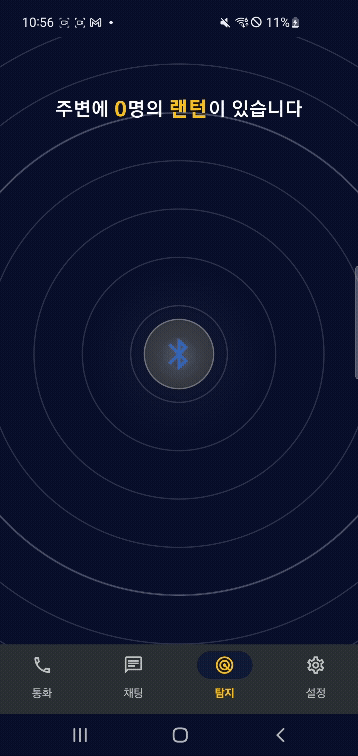

# SSAFY 12기 E204 Lantern - 랜턴


### 📡 통신이 끊겨도 걱정 마세요! 
### 🚶‍♀️ BLE Mesh로 사용자와 즉시 연결! 
### 🆘 재난 속 구조 요청부터 오프라인 소셜까지, 당신 곁엔 언제나 랜턴!

<br>

## 프로젝트 소개
 - 서비스 명: <b>랜턴 (Lantern) 
 - ✅ BLE Mesh 기반으로 인터넷 없이도 사용자 간 텍스트 및 음성 메시지를 주고받을 수 있는 오프라인 통신 애플리케이션
 - ✅ 재난, 통신 음영 지역, 대규모 행사 현장 등에서 Mesh 네트워크를 자율 구성하여 안정적인 긴급 구조 및 소셜 커뮤니케이션 제공상호작용에 직접 반영
 - ✅ 로컬 DB 기반 메시지 저장, TTL 설정 및 중복 전송 방지 기능을 포함하며, 온디바이스 AI를 활용한 음성 구조 요청 기능까지 지원

<br>

## 랜턴 컨셉
### 🕯️ 오프라인에서도 이어지는 연결
- BLE Mesh 기술을 활용하여 인터넷 없이도 주변 사용자와 실시간 소통 가능
### 🚨 위급 상황을 위한 즉각 대응
- 통신망이 끊긴 재난 현장에서도 구조 요청 및 음성 메시지를 릴레이 전달
### 📱 참여자 중심의 자율 네트워크
- 스마트폰들이 자동으로 중계 노드가 되어, 네트워크를 구성하고 유지
### 🗣️ 말로 전하는 구조 요청
- 온디바이스 AI 음성인식 기반으로, 손이 불편한 상황에서도 음성만으로 주변에 도움 요청

<br>

## 주요 기능 및 기술 활용

### 📡 BLE Mesh 기반 통신
 - 스마트폰 간 Bluetooth Low Energy 통신을 활용하여 자율적으로 Mesh 네트워크 구성
 - 인터넷이나 Wi-Fi 없이도 통신 가능
 - 중간 노드를 통한 다중 홉(hop) 메시지 및 음성 데이터 릴레이




### 💬 텍스트 메세지 송수신
- 메세지 TTL을 설정하여 전송 거리 및 횟수 제한
- UUID 및 해시 기반 중복 메시지 필터링을 통한 불필요한 재전송 방지
- 패킷 유실 최소화를 위한 큐 기반의 순차 처리 및 재전송 전략
- 수신 즉시 메시지를 브로드캐스트하여 실시간 네트워크 전파


<br>

## 🖥️ 기술 스택

### 📱 Front-End
- Kotlin  
- Jetpack Compose (UI)  
- Android Bluetooth LE API  
- BLE Mesh (자체 구현)  
- Room / SQLite (로컬 DB)  

### 🖥 Back-End
- Java  
- Spring Boot  
- MySQL  

### 🎙 Voice Trigger
- Porcupine (Wake Word Engine)  

### ☁ Infra
- AWS EC2  
- Docker  
- Nginx  
- Jenkins  

### 🛠 Management & Collaboration
- GitLab  
- Notion  
- Jira  
- Mattermost  

---

## 🏗️ 아키텍처 & 데이터 경계

**📌 한 줄 핵심:**  
오프라인 통신(BLE·Mesh) 기반 안드로이드 앱 **랜턴(Lantern)** 과, 최소 백엔드(Be)가 인증/토큰을 담당하는 멀티 리포 구조.  
앱 로컬 DB는 **Room**, 서버 DB는 **MySQL(RDB)** 로 `사용자/인증`에 집중.  
메시지/통화 기록은 주로 단말(Room)에 저장, 서버는 사용자·토큰·소셜로그인 매핑이 핵심.  

---

### 1) 백엔드 (Be)
- **Spring Boot + Security + OAuth2(Google) + JWT + MyBatis**  
- Google 로그인 → 서버가 JWT 발급  
- **DB 스키마:** `users`, 소셜 로그인 매핑, 토큰 관리  
- 메시지/콜 데이터는 서버에 저장하지 않음 → **인증 게이트웨이 역할**  

---

### 2) 모바일 앱
- **Kotlin + Jetpack Compose + Room**  
- BLE 모듈: `Advertiser` / `Scanner` / `GATT`  
- Mesh 레이어: `Transport` / `Security` / `Provisioning`  
- 서비스: `BleService`, `MeshNetworkService`, `CallService`  
- 로컬 영속화: `ChatRoom`, `Messages`, `CallHistory`, `User`, `Follow` 등 Room 엔티티  

---

### 3) 데이터 경계
- **서버:** 사용자/토큰/소셜로그인 매핑 중심, 장기 메시지 저장 없음  
- **클라이언트(Room):** 채팅/콜 로그/팔로우/메시지 전부 로컬에 저장 → **오프라인 퍼스트 UX**  

---

### 4) 아키텍처 플로우
```mermaid
flowchart TD
    User[사용자] -- Google OAuth --> BE[Be 서버]
    BE -- JWT 발급/검증 --> App[앱]

    subgraph Mobile App
        App -- Advertise/Scan/GATT --> Peer[주변 단말들]
        App --> RoomDB[(Room DB)]
        App -. JWT 포함 API 호출 .-> BE
    end

    Peer <-- Mesh Routing/Transport/Security --> App


