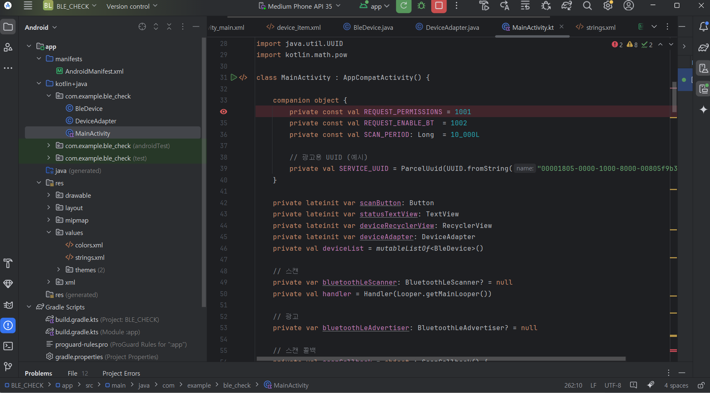

2025.04.21
바텐딩 앱 제안
가상 바텐더 캐릭터랑 같이 만드는 구성있으면 좋을듯.

정형적인 칵테일 레시피 확인, 필터링

커스텀 레시피 공유

리큐르, 위스키 등 주류 구매 정보 (가격, 판매 위치등 확인)

### 🔥 핵심 기능

| 기능 영역 | 기능 | 설명 |
| --- | --- | --- |
| 🍹 기본 레시피 | **정형화된 칵테일 DB** | 마가리타, 네그로니, 마티니 등 기본 레시피 제공 + 알코올 도수, 잔 종류, 도수별 필터링 |
| 🧑‍🍳 가상 바텐더 | **AI 바텐더와 함께 만들기** | “지금 기분이 어때요?”, “상큼한 거, 독한 거 어떤 거요?” → 추천 & 대화형 진행 |
| 🎨 커스텀 레시피 | **자작 칵테일 공유** | 유저가 자신만의 조합 작성 + 사진 & 이름 등록 (투표, 댓글 기능) |
| 🍾 주류 정보 | **술 구매 가이드** | 레시피에 쓰인 주류 → 가격 비교, 온라인/오프라인 판매처 연동 (전통주 포함 시 국산 위주 DB 구축도 가능) |
| 🧭 필터 기능 | **재료 기반 추천** | "내가 가진 재료: 진, 라임, 설탕" → 만들 수 있는 칵테일 리스트 |
| 🏆 챌린지 | **주간 칵테일 챌린지** | 예: '이번 주의 재료: 자몽 + 럼' → 유저들이 창작 조합 업로드 후 인기투표 |
| 🎥 튜토리얼 | **제조 영상 가이드** | 1인칭 시점 영상 / 가상 바텐더 음성 안내 / 컵/도구 설명 포함 |

### 네이밍 아이디어

- **바텐더즈 (BarTenders)**
- **믹스잇(MixIt)**
- **잔에담다**
- **칵폴리오 (Cockfolio)** — 칵테일 포트폴리오
- **한 잔 줄게요**

### 📈 확장 아이디어

- 위스키·리큐르 마니아 위한 테이스팅 기록장
- 도수·맛 프로파일 기반 AI 취향 분석
- 친구와 칵테일 대결 (투표형 이벤트)
- 칵테일 경험 공유 커뮤니티 + 감성 일기장 스타일


250422

아이디어 회의 - 실현가능성에 대해서

무전기 같은건 실패(BLE X)

해봐라
비행기 상황 좋네
좋은데 한정지을 필요있나?
지하, 전쟁, 군대 등 등 등 등 등 

인터넷 없이 사용할 수 있는 메신저.
인터넷 없을 때의 모드를 따로 둬야하나?
데이터들을 프론트에서 가지고 있어야할듯

화면적 보다는 기술적으로 빡세긴하다

구현만 하면된다

오프라인맵
지도 - 폴링방식
마지막에 됐던 시점 기준

가장큰 MVP하나 잡고 그외의 것들을 배제시켜가면서
채팅부터 되는지 확인하고 그 후에 하나씩 추가?

아이폰이 가능한가?
NATIVE적으로 들어간다면 코드가 2중으로...

교보재로 S10신청하자(2개)
코틀린이 풀스택

스프링부트가 필요가 없다..?
코틀린만 써야한다는..?
통신이안되는데 스프링부트가 어떻게 돌아가나나
로컬에서....... 웹소캣채팅구현
EC2도 필요가없나.? -> 지도 데이터 가져오고 캐싱하고 할려면 필요는 할듯
터질때도 써야하니까 일단 필요하다. .  . 
1시간 내 대화라던지 최근 30개 대화라던지만 저장되도록 해서..

기술적으로 될지?
백앤드적인부분 조사 필요
얻어가는 부분이 있긴할듯
블루투스 채팅이 MVP이면 채팅을 위해서는 백앤드는 없어도 될듯 - > 스프링서버가 네트워크로 통신하는데 그걸 쓰질않으니까 존재할 필요는 없다.
블루투스로 통신하면 저장이 되나..?
어떻게 동기화 할지
6명에서 한다 생각하면 MESH 망 어떻게 할지..
1대1이면 의미가 없지 않나.. 없진 않다.

멀리있는 사람인데 중간사람 거쳐서 멀리있는 사람과 대화하는 거면 특색이 되게 있을듯

브릿지파이?
-> 없어진듯
파이어챗?
-> 외국거거

볼륨은 안큰데 기술의 깊이가 깊다
포장만 잘하면 굿

AI요소 추가할 거 없을까?

2025.04.24
안드로이드 스튜디오 설치 후 사용 방법 연구.
BLE 통신을 위한 코드 구성
BLE 신호를 탐색하기 위한 코드 구현

에뮬레이션으로는 정상작동하지만 실제 폰으로 안해봐서 검증 필요

2025.04.25
보안 연구

**SIGNAL PROTOCOL**

- 강력한 전방 비밀성 (forward secrecy) 과 침해 후 보안성 (post-compromise security) 을 제공하는 현대적 메시징 암호화 프로토콜

-핵심 원리

- **Identity Key Pair**
    - 장기 키 쌍. 각 디바이스가 한 번 생성하여 안전하게 보관
- **Signed PreKey**
    - 중기 키 쌍. Identity Key로 서명된 공개키. 탈취되면 일정 기간만 유효
- **One-time PreKey**
    - 일회용 단기 키 쌍. 초기 핸드셰이크에만 사용
- **PreKeyBundle**
    - 위 세 가지 공개키와 사용자 등록 ID를 묶어 “처음 만날 때” 교환

※ 핸드셰이크란?

⇒단순히 **첫 키 교환**이 아니라, 그 교환을 통해 **세션의 모든 향후 암호화·복호화 동작을 보장할 수 있는 초기 상태**를 만드는 일련의 과정
- PreKeyBundle 획득 → Diffie-Hellman 교환 → 초키 루트키 및 체인키 생성 →세션 레코드 저장

※ Diffie-Hellman(DH)란?

- 서로 비밀 채널 없이도 공통의 비밀값을 안전하게 생성
- 공개된 숫자(p, g) 아래에서 각자 비밀 지수(a, b)를 선택해


- **Double Ratchet**에서는 매 메시지 또는 주기마다 새로운 DH 키 쌍을 생성해 위 과정을 반복 → **Forward Secrecy** 강화

※ PreKeyBundle 플로우

- **A**가 서버에 자신의 PreKeyBundle 업로드
- **B**가 A에게 메시지 보낼 때, 서버로부터 A의 PreKeyBundle를 가져옴
- **B**는
    - 자신의 DH 공개키 B_DH
    - PreKeyBundle 내
        
        
        
        (중기 키, 일회용 키)를 이용해 초기 DH 교환 수행
        
- **A**는 B의 첫 메시지 헤더에 포함된 B_DH로부터 대응 DH 연산 수행
- 이후 양측 모두 **SessionRecord**에 root key, chain key 등을 저장

## Double Ratchet 메커니즘

Signal Protocol의 핵심은 두 가지 ‘래칫(ratchet)’을 번갈아 가며 돌리는 구조

| Ratchet 종류 | 역할 |
| --- | --- |
| **Diffie–Hellman Ratchet** | 주기적으로 새로운 DH 키 쌍을 생성 → 루트 키(root key) 갱신 |
| **Symmetric-Key Ratchet** | 각 메시지마다 대칭키(chain key)로부터 메시지 키(message key) 파생 |

### 1. 초깃값 설정: PreKeyBundle 교환 → Root Key 초기화

- **래칫 종류**: **DH Ratchet (첫 핸드셰이크 단계)**
- **동작**:
    1. A의 PreKeyBundle(Identity PK, Signed PreKey, One-time PreKey)과 B의 임시 DH 키 공개값 B_DH을 교환
    2. 각자 DH 연산을 통해 **Root Key** 생성

> 이 과정으로 “첫 번째” Root Key가 세션에 설정
> 

---

### 2. 메시지 전송 시 래칫

### 2-a. (Optional) 새로운 DH 키 생성 → Root Key 갱신

- **래칫 종류**: **DH Ratchet**
- **동작**:
    1. 송신 측이 새 DH 키 쌍 생성
    2. 헤더에 새 공개키  포함
    3. 수신 측이 다시 DH 연산 → 새로운 Root Key 계산

> 이 DH 게이트웨이를 돌리는 순간마다 “루트 시크릿”이 안전하게 재갱신
> 

### 2-b. Chain Key → Message Key 파생 → AES-GCM 암호화+MAC

- **래칫 종류**: **Symmetric-Key Ratchet**
- **동작**:
    
    
    

> 이 대칭 래칫은 “각 메시지마다 독립적인 대칭키”를 만들어서, 과거 키 노출 시에도 이후 메시지에는 영향 X
> 

---

### 3. 수신 측 복호화

- **DH Ratchet 적용**: 헤더의 DH 공개키로 Root Key 갱신 (2-a)
- **Symmetric Ratchet 적용**: 자신의 Chain Key로 올바른 Message Key 파생 → 복호화 (2-b)

---

## 결론

- **PreKeyBundle 교환과 “새 DH 키” 주고받기**가 **DH Ratchet**
- **Chain Key(KDF)→Message Key 파생 후 AEAD 암호화**가 **Symmetric-Key Ratchet**
- 따라서 “초기 핸드셰이크”부터 “메시지 암호화”까지의 전 과정을 **두 래칫이 협력**

## libsignal-protocol-java 구조

Signal 팀에서 공개한 자바 구현체이며, 주요 클래스:

- `KeyHelper` : Identity Key, PreKey, SignedPreKey 생성
- `SignalProtocolStore` : 키·세션 상태 저장 인터페이스
- `PreKeyBundle` : 핸드셰이크용 키 묶음
- `SessionBuilder` : 초기 핸드셰이크 처리 (PreKeyBundle → 세션 레코드)
- `SessionCipher` : 실제 메시지 암호화/복호화

라이브러리가 **Double Ratchet 모든 동작**을 내부에서 처리해 주므로, 우리는

1. 키 생성 & 번들 교환
2. `SessionBuilder.process()`
3. `SessionCipher.encrypt()/decrypt()`

만 호출해 주면됨

※ AES-GCM이란?


## MAC (Message Authentication Code)

- **목적**: 메시지가 전송 도중 변조되지 않았음을 검증
- **GCM의 MAC**: GHASH


| 개념 | 기능/방식 |
| --- | --- |
| **DH (Diffie–Hellman)** | 공개키 교환으로 공유 비밀 생성 (forward secrecy) |
| **PreKeyBundle** | 오프라인 키 교환을 위한 사전 공개키 묶음 (Identity, SignedPreKey, One-time) |
| **Chain Key** | KDF로부터 메시지 키 파생 → 각 메시지마다 독립 키 제공 |
| **AES-GCM** | AES-CTR 암호화 + GHASH MAC 으로 기밀성·무결성 보장 |
| **MAC (GHASH 태그)** | 변조 검증용 태그, 수신 측 재검증 → 인증 실패 시 폐기 |

## Signal Protocol에서의 KDF

### 3-1. Root Key → Chain Key

- DH Ratchet 결과물인 루트 키(RK)를 **HMAC 기반 KDF**에 넣어서
    
    ```
    CK0 = KDF_root(RK,  “Chain”)
    ```
    

### 3-2. Chain Key → 다음 Chain Key + Message Key

- Symmetric-Key Ratchet 단계에서는 매 메시지마다
    
    ```
    CK_{n+1} = HMAC(CK_n, 0x01)
    MK_n     = HMAC(CK_n, 0x02)
    ```
    
    와 같은 단순 HMAC-KDF 구조를 씁니다.
    
    - `0x01`, `0x02`는 구분자(label) 역할
    - 이렇게 하면 메시지 순서와 무관하게 각 `MK_n`을 독립적으로 복원할 수 있고,
        
        과거 CK나 MK 노출 시 이후 키는 안전하게 지킬 수 있습니다.
        

## 📨 1. 신분증명 (Identity Key)

- **비유**: 편지를 보낼 때 내 얼굴이 찍힌 신분증
- **역할**: “이 편지는 진짜 **나**가 보낸 거야” 라고 증명

---

## 🔐 2. 미리 준비된 잠금장치들 (PreKeyBundle)

- **비유**: 우체국에 맡겨 둔 **여러 개의 잠금장치(자물쇠)**
    - 중간용 자물쇠(관리자 서명된 Signed PreKey)
    - 일회용 자물쇠(One-time PreKey)
- **역할**: 상대가 **오프라인**이더라도, 이 자물쇠를 가져다 쓸 수 있게 함

---

## 🤝 3. 첫 손잡이 – 핸드셰이크

1. **사전 준비**
    - A(수신자)는 우체국(서버)에 자물쇠 묶음(PreKeyBundle)을 보관
2. **비밀 약속**
    - B(송신자)는 A의 자물쇠 하나를 꺼내 와서 내 손잡이용 열쇠(임시 DH 키)를 만들어 헤더에 붙임
3. **공동 비밀 생성**
    - A는 B가 붙여 보낸 열쇠를 받아서, 자기 자물쇠와 맞춰 보고 동일한 **공동 비밀값(shared secret)** 을 생성
4. **첫 상태 저장**
    - 이 순간이 “첫 번째 약속(루트키)”이고, 이후 편지 교환의 **기준점**이 됨

---

## 🔄 4. 편지마다 바뀌는 자물쇠 (Double Ratchet)

### A. 새로운 자물쇠 교환 – DH Ratchet

- 매번 “오늘의 자물쇠”를 새로 만들어 서로 주고받으면
- **누가 보면 과거 약속은 몰라도, 지금 약속만 알고 있겠죠?** → 전방 비밀성

### B. 자물쇠에서 새 열쇠 꺼내기 – Symmetric Ratchet

- 각 편지마다
    1. 가장 최근 자물쇠에서 **다음 열쇠(chain key)** 를 뽑고
    2. 그 열쇠 하나를 **실제 편지 봉인(message key)** 에 사용
- **편지마다 다른 열쇠**를 쓰니까, 하나 열쇠가 유출돼도 다른 편지는 안전

---

## 🔑 5. 봉인과 인증 – AES-GCM

- **봉인(AES-CTR)**: 메시지를 감싸는 밀봉 포장
- **인증(GHASH-MAC)**: 포장을 뜯어보지 않았는지 확인하는 **씰(seal)**
- 이 두 가지를 합쳐서 **AEAD**라고 부르고,
    
    “봉인과 씰이 모두 동일해야만 열어볼 수” 있게 해 줍니다.
    

---

## 🗺️ 전체 흐름

```
[준비] A → 서버에 자물쇠 묶음(PreKeyBundle) 보관
[핸드셰이크] B → A 자물쇠로 첫 열쇠 교환 → 공동 비밀 생성 → 루트키 설정
[편지1]   B → 루트키→체인키→메시지키 뽑아 봉인 → A가 같은 방식으로 열어보기
[편지2]   (옵션) 새 자물쇠 교환 → 새로운 루트키 → 다시 체인키 뽑아 봉인 → 복호화
```

- **핸드셰이크**: 첫 번째 **안전한 약속**
- **DH Ratchet**: 새 자물쇠 주고받기
- **Symmetric Ratchet**: 자물쇠 하나에서 매번 다른 열쇠 꺼내 쓰기
- **AES-GCM**: 편지 봉인 + 무결성 검증

## 내 프로젝트에 X3DH가 적합할까?

- **장점**
    - **비동기성**: 수신자가 오프라인일 때에도(예: 전원이 꺼져 있거나 범위 밖이어도)
        - 송신자는 PreKeyBundle만 있으면 언제든 첫 메시지를 암호화해 보낼 수 있습니다.
    - **메시지 지연 허용**: 메시지가 중간 노드에 잠시 머물러도, 나중에 수신자가 돌아오면 복호화 가능
- **단점**
    - **인프라 필요**: PreKeyBundle(IdentityPK, SignedPreKey, One-timePreKey)을
        - 중앙 서버나 Mesh 내 분산 저장소(또는 BLE 광고 패킷/GATT 통해 주기적 배포) 같은 방식으로
        - **안전하게** 배포·갱신할 수 있는 메커니즘이 있어야 합니다.
    - **오버헤드**: 추가 DH 연산(총 3~4회)과 PreKeyBundle 교환으로 인한 코드·데이터 복잡도 증가

EX)

## 1. 초기화 & 키 생성

```kotlin

object CryptoManager {
    private lateinit var store: SignalProtocolStore
    private lateinit var identity: IdentityKeyPair
    private var registrationId: Int = 0

    fun initialize(context: Context) {
        // In-Memory 스토어 생성 (실제론 영구 저장소 필요)
        store = InMemorySignalProtocolStore()
        // 장기 Identity 키 쌍 생성
        identity = KeyHelper.generateIdentityKeyPair()
        // registrationId 생성
        registrationId = KeyHelper.generateRegistrationId(false)
    }
    ...
}

```

- **IdentityKeyPair**: Signal Protocol의 장기 키. 앱 당 한 번만 생성해서 보관
- **SignalProtocolStore**: 키·세션 상태 보관소. 내부적으로 각종 `SessionRecord`, `PreKeyRecord` 등을 저장

여기까지가 “누굴 만나든 사용할 내 키(material)”을 세팅하는 단

---

## 2. PreKeyBundle 생성 (핸드셰이크 준비)

```kotlin

fun generatePreKeys(): PreKeyBundle {
    val preKeyId = 1
    val signedPreKeyId = 1

    // One-time PreKey (일회용 단기 키)
    val preKeyPair = KeyHelper.generatePreKey(preKeyId)
    // Signed PreKey (중기 키, identity 키로 서명됨)
    val signedPreKeyPair = KeyHelper.generateSignedPreKey(identity, signedPreKeyId)

    return PreKeyBundle(
        registrationId,           // 내 registration ID
        1,                        // 내 기기 ID (subdevice)
        preKeyPair.id,            // One-time PreKey ID
        preKeyPair.keyPair.publicKey,
        signedPreKeyId,           // Signed PreKey ID
        signedPreKeyPair.keyPair.publicKey,
        signedPreKeyPair.signature,
        identity.publicKey        // Identity 공개키
    )
}

```

- **PreKeyBundle**: 초기 핸드셰이크에 사용되는 공개키 묶음.
- 서버나 안전 채널을 통해 상대방에게 전달 → “첫 키 교환”의 재료가 됨.

---

## 3. 암호화: `encrypt(...)`

```kotlin

fun encrypt(remoteAddress: SignalProtocolAddress, plain: ByteArray): CiphertextMessage {
    // 1) 초기 DH Ratchet: 첫 메시지 전 세션 초기화
    val builder = SessionBuilder(store, remoteAddress)
    builder.process(generatePreKeys())

    // 2) 메시지 암호화 & Symmetric Ratchet
    val cipher = SessionCipher(store, remoteAddress)
    return cipher.encrypt(plain)
}

```

1. **`SessionBuilder.process(generatePreKeys())`**
    - 내부적으로
        - `PreKeyBundle`에 담긴 Signed PreKey, One-time PreKey와 나의 identity key로 DH 연산
        - 그 결과로 **root key**를 초기화
    - 이 순간이 **DH Ratchet**의 핵심: 첫 번째 shared secret을 만들고,
        
        이후 대칭 래칫을 위해 “시작점”을 설정합니다.
        
2. **`SessionCipher.encrypt(plain)`**
    - **Symmetric-Key Ratchet**
        - `root key` → KDF → **chain key** 생성
        - `chain key` → 다시 KDF → 이번 메시지의 **message key** 파생
    - **AES-GCM AEAD 암호화**
        - `message key`를 AES-GCM의 키로 써서 `plain`을 암호화
        - 암호문에 무결성 검사용 MAC(tag)을 자동으로 붙여줌
    - 반환값인 `CiphertextMessage` 안에
        - 헤더(Header: DH 공개키, 메시지 인덱스…)
        - 암호문(`ciphertext`) + MAC(`tag`)
            
            가 모두 담깁니다.
            

---

## 4. 복호화: `decrypt(...)`

```kotlin

fun decrypt(remoteAddress: SignalProtocolAddress, msg: CiphertextMessage): ByteArray {
    val cipher = SessionCipher(store, remoteAddress)
    return when (msg) {
        is PreKeySignalMessage -> cipher.decrypt(msg)  // 첫 메시지
        is SignalMessage       -> cipher.decrypt(msg)  // 후속 메시지
        else                   -> throw IllegalArgumentException("Unknown message type")
    }
}

```

1. **헤더에서 DH 공개키 읽기**
    - `PreKeySignalMessage`인 경우:
        - 헤더에 담긴 상대방의 임시 DH 공개키를 꺼내
        - 나의 대응 DH 비밀키로 두 번째 DH 연산 → **root key** 갱신
    - `SignalMessage`인 경우:
        - Symmetric-Key Ratchet만 적용 (이미 root key 준비됨)
2. **Symmetric-Key Ratchet & AEAD 복호화**
    - 체인 키를 통해 올바른 `message key`를 파생
    - AES-GCM 복호화:
        - 암호문 + 태그를 넣고, MAC 검증에 성공해야 복호화 진행
    - 결과는 `ByteArray(평문)`

---

### 전체 호출 흐름 예시

```kotlin

// 송신 측
val addr = SignalProtocolAddress("DEVICE_B", 1)
val cipherMsg = CryptoManager.encrypt(addr, "Hello, BLE Mesh!".toByteArray())

// 네트워크 전송 → 중간 노드들 포워딩 (암호 해제 불가)

// 수신 측
val decryptBytes = CryptoManager.decrypt(addr, cipherMsg)
val text = String(decryptBytes)  // "Hello, BLE Mesh!"

```

- **송신**: `encrypt()` 안에서
    - ① DH Ratchet (최초 root key)
    - ② Symmetric Ratchet (message key)
    - ③ AES-GCM 암호화 + MAC 태그
- **수신**: `decrypt()` 안에서
    - ① 헤더의 DH 공개키로 DH Ratchet (root key 갱신)
    - ② Symmetric Ratchet (message key 파생)
    - ③ AES-GCM 복호화 + MAC 검증